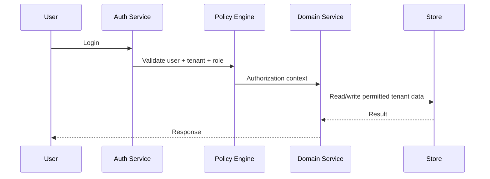
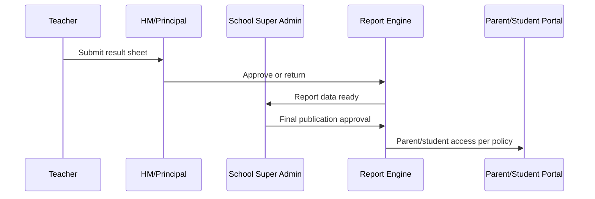
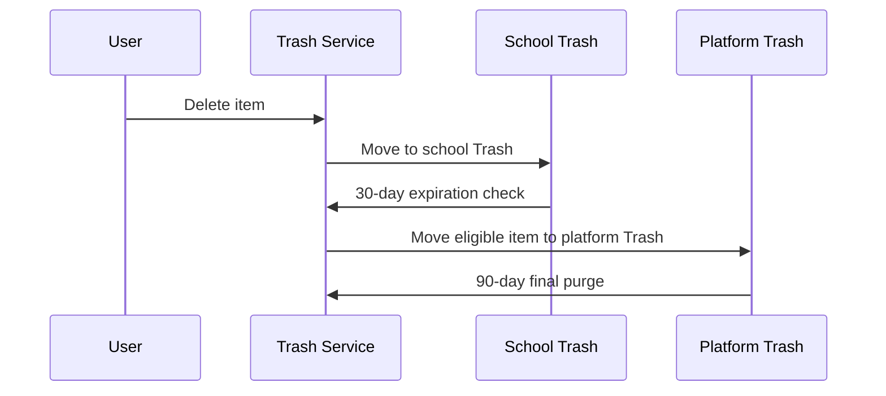

# Data Flow Diagrams

## Authentication and authorization flow

```mermaid
sequenceDiagram
    participant U as User
    participant A as Auth Service
    participant P as Policy Engine
    participant D as Domain Service
    participant S as Store
    U->>A: Login
    A->>P: Validate user + tenant + role
    P->>D: Authorization context
    D->>S: Read/write permitted tenant data
    S-->>D: Result
    D-->>U: Response
```

## Result approval and publication flow

```mermaid
sequenceDiagram
    participant T as Teacher
    participant H as HM/Principal
    participant SS as School Super Admin
    participant R as Report Engine
    participant P as Parent/Student Portal
    T->>H: Submit result sheet
    H->>R: Approve or return
    R->>SS: Report data ready
    SS->>R: Final publication approval
    R->>P: Parent/student access per policy
```

## Trash retention flow

```mermaid
sequenceDiagram
    participant U as User
    participant X as Trash Service
    participant T as School Trash
    participant P as Platform Trash
    U->>X: Delete item
    X->>T: Move to school Trash
    T->>X: 30-day expiration check
    X->>P: Move eligible item to platform Trash
    P->>X: 90-day final purge
```
