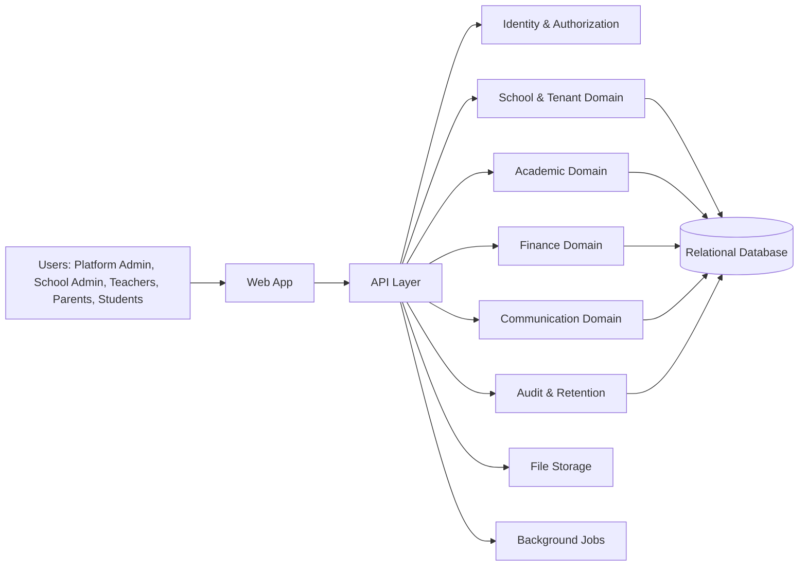

# System Overview

## Architectural direction

The project should be implemented as a modular SaaS platform with clear separation between:

- Platform operations
- Tenant configuration and governance
- Identity and authorization
- Academic operations
- Finance and communications
- Audit, notifications, retention, and security

## Proposed architecture model

- Frontend: a configurable tenant-aware web application
- Backend: modular API services or a single service with domain boundaries
- Database: relational database with strict tenant-scoped integrity
- File storage: tenant-scoped object storage or secure file service
- Jobs: background processing for notifications, retention, sync, and payment verification

## Mermaid overview

## Constraints

- No platform user has automatic access to all school data.
- No school user is permitted to access another school tenant.
- Public branding is configurable and decoupled from core product naming.
