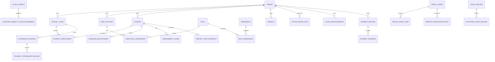

# Entity Relationship Diagram

```mermaid
erDiagram
    TENANT ||--o{ SCHOOL_CLASS : owns
    TENANT ||--o{ USER_ACCOUNT : owns
    TENANT ||--o{ STUDENT : owns
    TENANT ||--o{ SUBJECT : owns
    USER_ACCOUNT ||--o{ USER_ROLE_ASSIGNMENT : has
    ROLE ||--o{ USER_ROLE_ASSIGNMENT : grants
    ROLE ||--o{ ROLE_PERMISSION : includes
    PERMISSION ||--o{ ROLE_PERMISSION : assigned
    SCHOOL_CLASS ||--o{ STUDENT_ENROLLMENT : contains
    STUDENT ||--o{ STUDENT_ENROLLMENT : enrolled_in
    STUDENT ||--o{ GUARDIAN_RELATIONSHIP : linked
    CLASS_SUBJECT ||--o{ TEACHER_SUBJECT_CLASS_ASSIGNMENT : validates
    SCHOOL_CLASS ||--o{ ATTENDANCE_SESSION : hosts
    ATTENDANCE_SESSION ||--o{ STUDENT_ATTENDANCE_RECORD : records
    STUDENT ||--o{ ASSESSMENT_SCORE : has
    RESULT_SHEET ||--o{ RESULT_SHEET_ROW : contains
    STUDENT ||--o{ REPORT_CARD_SNAPSHOT : receives
    RESULT_SHEET ||--o{ REPORT_PUBLICATION_EVENT : produces
    TENANT ||--o{ NOTICE_BOARD_ITEM : publishes
    TENANT ||--o{ CLASS_ANNOUNCEMENT : owns
    TENANT ||--o{ PAYMENT_RECORD : tracks
    PAYMENT_RECORD ||--o{ PAYMENT_EVIDENCE : includes
    TRASH_RECORD ||--o{ PLATFORM_TRASH_RECORD : retains
```

## Notes

This diagram reflects the logical model and should be refined as the schema becomes implementation-ready.
